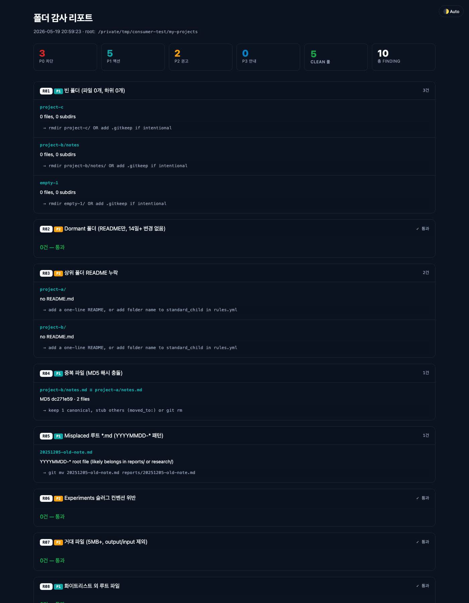

# kairos-folder-audit

[English](./README.md) · **한국어**

> **한 줄 명령. 10가지 체크. 매주 자동. 폴더 걱정 끝.**


## 설치

```bash
pipx install git+https://github.com/sunyoung-lee/kairos-folder-audit.git
```

pipx가 없으면 AI 에이전트에게 본인 OS에 맞게 설치 부탁하세요.

## 사용

```bash
folder-audit
```

HTML 리포트 생성 + 자동 오픈. 한국어 사용자는 자동으로 한국어 출력.

## 받는 가치

- **한 줄 명령**으로 전체 폴더 audit
- **HTML 리포트** — 저장·공유·나중에 다시 열기
- **매주 자동 실행** — 한 번 세팅, 다시 안 챙김
- **스트레스 0** — "6개월 전에 `.env` 커밋했나?" 다시는 안 떠올림

## 이런 분에게 좋아요

- 사이드 프로젝트 **5개 이상** 운영하는 1인 인디 메이커
- **Claude Code / Cursor**로 매일 AI 페어 코딩하는 개발자
- repo · 노션 · Drive에 **200개 이상 파일** 흩어진 분
- _"이 폴더 뭐였더라?"_ 자주 떠오르는 분

## 이런 상황에서 활용해요

- **일요일 아침** — 새 주 시작 전 가벼운 점검
- **새 프로젝트 시작 직전** — 기존 폴더 먼저 정리
- **6개월 누적 후** — 한 번에 통합 정리, 전체 상태 한눈에
- **repo public 공개 전** — `.env` 노출 / 중복 / 큰 파일 점검
- **AI 페어링 끝난 직후** — 잔여 파일·중복 노트 청소

## 리포트 예시



## 10가지 체크

| ID  | Sev | 무엇을 잡는가                                  |
| --- | --- | --------------------------------------------- |
| R01 | P1  | 빈 폴더                                       |
| R02 | P2  | Dormant 폴더 (README만, 14일+ 변경 X)         |
| R03 | P2  | README 누락                                   |
| R04 | P1  | 중복 파일 (MD5)                               |
| R05 | P1  | Misplaced 루트 `.md` (YYYYMMDD-* 패턴)        |
| R06 | P2  | Experiments 슬러그 컨벤션                     |
| R07 | P2  | 거대 파일 (5MB+)                              |
| R08 | P1  | 화이트리스트 외 루트 파일                     |
| R09 | P3  | Untracked git 누적 (10건+)                    |
| R10 | P0  | `.env` 보호                                   |

## 심각도 안내

- **P0 차단** — 즉시 수정. 보안 또는 데이터 손실 위험.
- **P1 액션** — 이번 주 안에 처리. 구조 무결성.
- **P2 권고** — 이번 달 안에 처리. 유지보수성.
- **P3 안내** — 인지만. 급한 액션 X.
- **Clean** — 잡은 게 없음. 해당 영역 건강.

## 결과 받으면 무엇을 하나

AI 에이전트에게 부탁:

> _"folder-audit 리포트 열어서 P0와 P1 finding 수정해줘. 변경 전에 각각 보여주고."_

에이전트가 리포트를 읽고, 수정 계획을 짜고, 승인하면 적용합니다.

## 매주 일요일 자동

AI 에이전트에게 부탁:

> _"`folder-audit`를 매주 일요일 06:00에 내 projects 폴더에 실행해서 리포트를 Desktop에 저장하는 주기 작업 등록해줘. `--no-open` 옵션도 추가."_

에이전트가 OS · 경로 · 스케줄러 다 알아서 처리. 적용 전 검토.

한 번 세팅, 다시 안 챙김.

## 라이센스

[MIT](./LICENSE) © 2026 Sunny Lee

—

[@sun.young.0207](https://instagram.com/sun.young.0207) — Instagram · [Threads](https://threads.net/@sun.young.0207)
