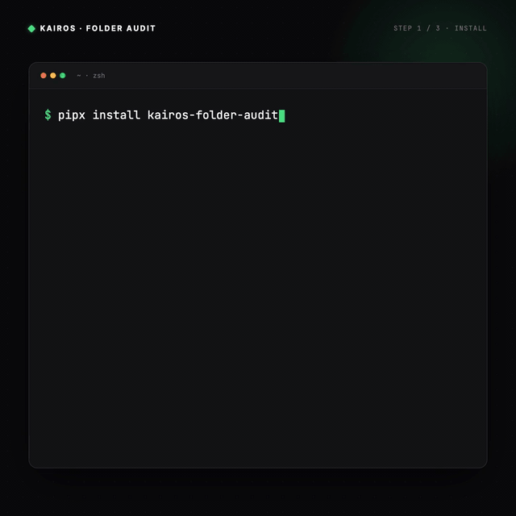
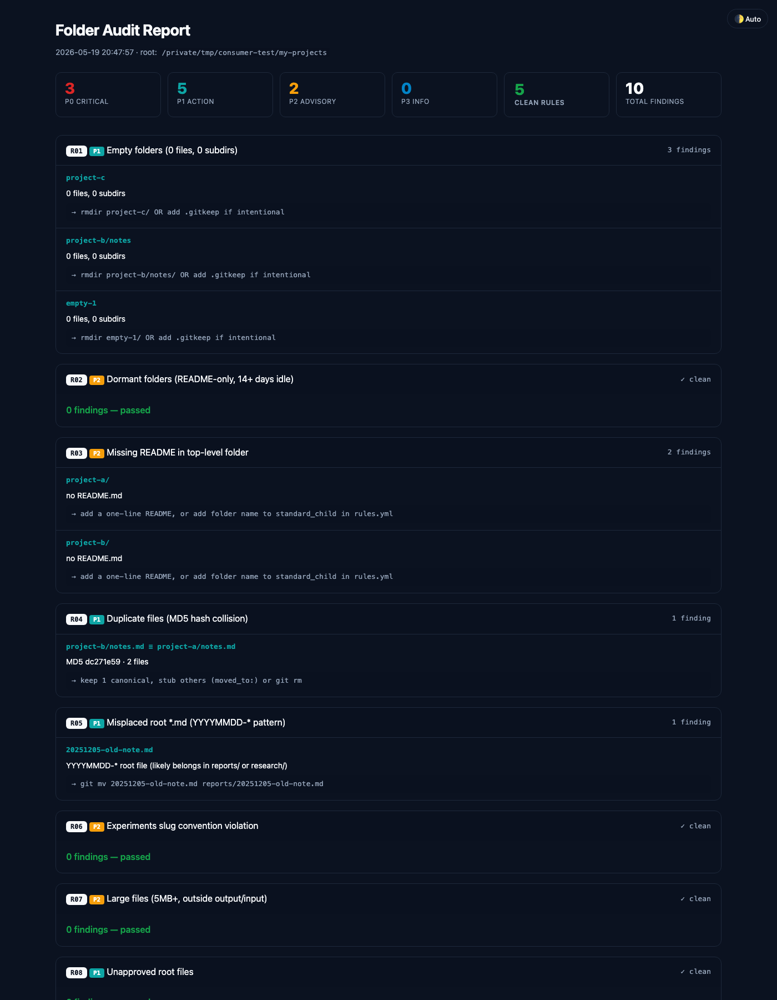

# kairos-folder-audit

**English** · [한국어](./README.ko.md)

> **One command. 10 checks. Weekly auto-run. Folder peace of mind.**



## Install

```bash
# Recommended
pipx install git+https://github.com/sunyoung-lee/kairos-folder-audit.git

# Or uvx (no install)
uvx --from git+https://github.com/sunyoung-lee/kairos-folder-audit.git folder-audit

# Or single-file (zero setup)
curl -sSL https://raw.githubusercontent.com/sunyoung-lee/kairos-folder-audit/main/folder_audit.py -o folder_audit.py && python3 folder_audit.py
```

## Use

```bash
folder-audit
```

Generates `./folder-audit-report.html` and **auto-opens it in your browser**. Detects language from `$LANG` (Korean speakers get Korean output automatically).

Skip auto-open: `--no-open`. Force language: `--lang en` or `--lang ko`.

## What you get

- **One command**, full folder audit
- **HTML report** — save, share, open later
- **Weekly auto-run** — set once, never check manually
- **No more stress** — "did I commit `.env` 6 months ago?" never again

## Who this is for

- Solo indie makers running **5+ side projects** at once
- AI pair coders shipping with **Claude Code / Cursor** daily
- Anyone with **200+ files** across repos, Notion, or Drive
- People who keep thinking _"what was this folder for again?"_

## When to use it

- **Sunday morning** — light check before the new week
- **Before a new project** — tidy what you already have
- **After 6 months of chaos** — bulk cleanup, see everything at once
- **Before pushing public** — catch `.env` leaks, duplicates, large files
- **Right after an AI pair session** — clean up leftover artifacts

## Sample report



## The 10 checks

| ID  | Sev | Catches                                          |
| --- | --- | ------------------------------------------------ |
| R01 | P1  | Empty folders                                    |
| R02 | P2  | Dormant folders (README-only, 14+ days idle)     |
| R03 | P2  | Missing README                                   |
| R04 | P1  | Duplicate files (MD5)                            |
| R05 | P1  | Misplaced root `.md` (YYYYMMDD-* pattern)        |
| R06 | P2  | Experiments slug convention                      |
| R07 | P2  | Large files (5MB+)                               |
| R08 | P1  | Unapproved root files                            |
| R09 | P3  | Untracked git accumulation (10+)                 |
| R10 | P0  | `.env` protection                                |

## Severity legend

- **P0 critical** — Fix immediately. Security or data-loss risk.
- **P1 action** — Address within the week. Structural integrity or build impact.
- **P2 advisory** — Address within the month. Maintainability and clarity.
- **P3 info** — Awareness only. No urgent action needed.
- **Clean** — Rule found nothing in this area. Healthy.

## What to do after a run

The audit hands you a report. The cleanup is one prompt away.

**With Claude Code / Cursor / any AI agent** — the recommended flow:

1. Run `folder-audit` (CLI output stays in your terminal)
2. Copy the CLI output, or drag the HTML report into your AI session
3. Prompt: _"Fix the P0 and P1 findings. Show me each change before applying."_
4. Review → approve → done.

That's the whole loop. **Audit → AI → cleanup.** No manual command-by-command.

**Or manually** if you want hands-on control:

- **P0** → fix immediately (security / data risk)
- **P1** → fix within the week (structural)
- **P2 / P3** → batch for next Sunday's cron

Common rule shortcuts:

- **R01 empty folder** → `rmdir <path>/` or add `.gitkeep` if intentional
- **R03 missing README** → add a 1-line `README.md`, or whitelist the folder via `standard_child` in `rules.yml`
- **R04 duplicate** → keep one canonical, `git rm` the rest
- **R05 misplaced `.md`** → `git mv <file> reports/<file>`
- **R10 `.env` exposed** → `echo ".env" >> .gitignore && git rm --cached .env`

The real win: set up the [Sunday cron](#auto-every-sunday) below. Audit runs itself weekly, you paste into AI, move on with your week.

## Auto every Sunday

**Cron gotcha**: cron's `PATH` is minimal and `~` may not expand. Use absolute paths.

Find your `folder-audit` location first:

```bash
which folder-audit
# e.g. /Users/YOU/.local/bin/folder-audit
```

Then crontab (Linux / macOS):

```cron
0 6 * * 0  /Users/YOU/.local/bin/folder-audit --path /Users/YOU/projects --out /Users/YOU/Desktop/folder-audit.html --no-open
```

Replace `/Users/YOU` with your home, and `projects` with the folder you want audited.

**macOS recommended — launchd** (more native than cron):

Save as `~/Library/LaunchAgents/com.user.folder-audit.plist`:

```xml
<?xml version="1.0" encoding="UTF-8"?>
<!DOCTYPE plist PUBLIC "-//Apple//DTD PLIST 1.0//EN" "http://www.apple.com/DTDs/PropertyList-1.0.dtd">
<plist version="1.0">
<dict>
  <key>Label</key><string>com.user.folder-audit</string>
  <key>ProgramArguments</key>
  <array>
    <string>/Users/YOU/.local/bin/folder-audit</string>
    <string>--path</string><string>/Users/YOU/projects</string>
    <string>--out</string><string>/Users/YOU/Desktop/folder-audit.html</string>
    <string>--no-open</string>
  </array>
  <key>StartCalendarInterval</key>
  <dict>
    <key>Weekday</key><integer>0</integer>
    <key>Hour</key><integer>6</integer>
    <key>Minute</key><integer>0</integer>
  </dict>
</dict>
</plist>
```

Load it:

```bash
launchctl load ~/Library/LaunchAgents/com.user.folder-audit.plist
```

Either way, set this once. Report lands on your Desktop every Sunday 6 AM. Stop remembering.

## License

[MIT](./LICENSE) © 2026 Sunny Lee

—

[@sun.young.0207](https://instagram.com/sun.young.0207) — Instagram · [Threads](https://threads.net/@sun.young.0207)
